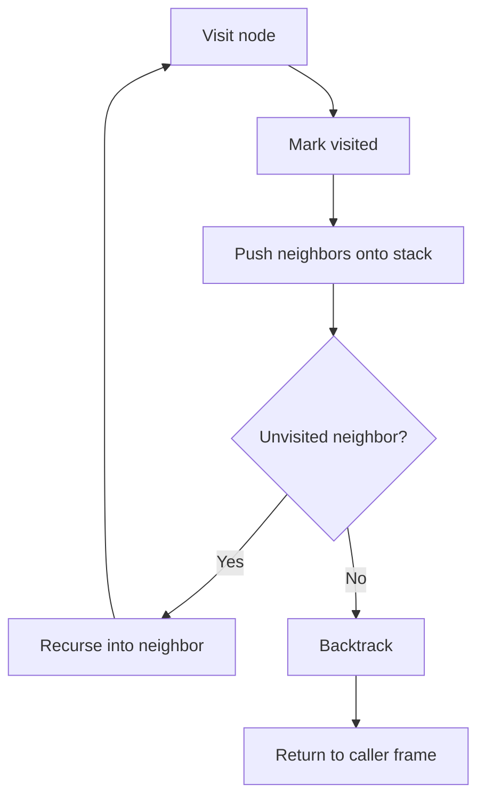
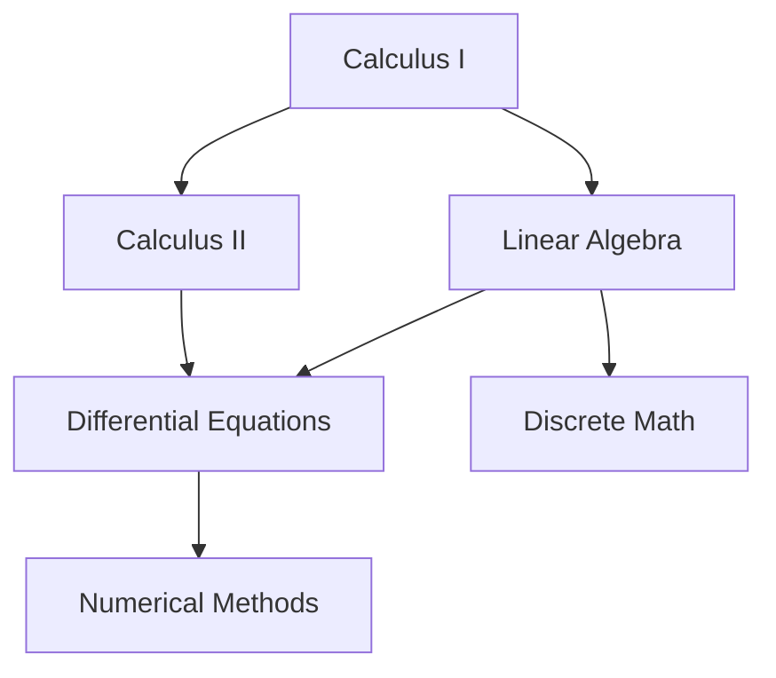
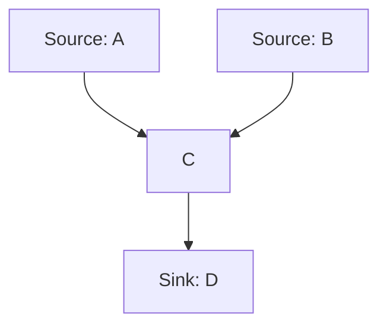
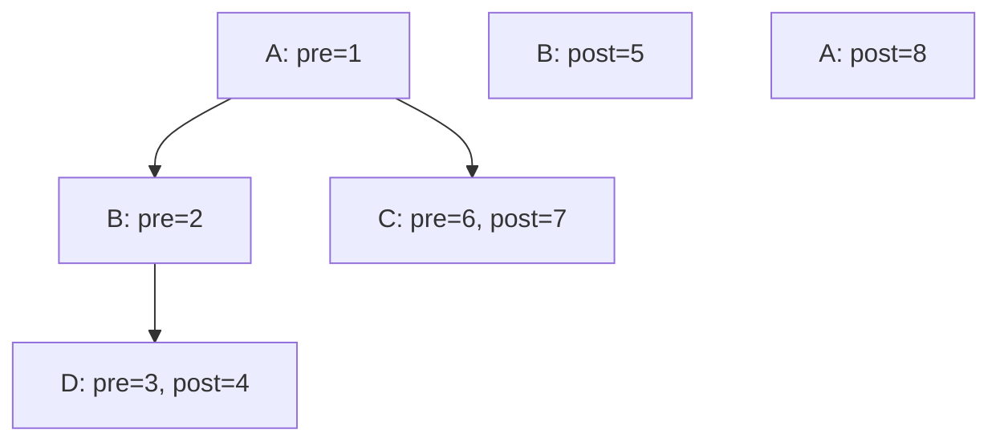
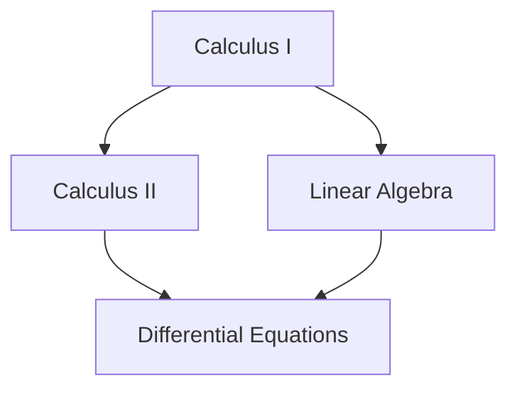

# SPL Run: build_concept_book

- **Adapter:** claude_cli
- **Model:** claude-sonnet-5
- **Tokens:** 5874 in / 3722 out
- **Latency:** 83027ms
- **Timestamp:** 2026-09-27 12:18:02

## Output

```output


---

## Depth First Search

**Depth-first search (DFS)** is a graph traversal algorithm that explores a graph by going as deep as possible along each branch before backtracking. Starting from a source vertex, DFS visits an unvisited neighbor, marks it, and recurses into it immediately — only returning to explore other branches once a path is fully exhausted. This "explore-then-backtrack" behavior contrasts with breadth-first search, which expands level by level using a queue.

Formally, given a graph $G = (V, E)$, DFS maintains a `visited` set and a call stack (explicit or via recursion). For a vertex $v$, DFS performs: mark $v$ visited; for each neighbor $u$ of $v$, if $u$ is unvisited, recursively call $\text{DFS}(u)$. The recursion terminates when every reachable vertex has been marked. Each vertex is pushed once and popped once, so the time complexity is $O(|V| + |E|)$ — every vertex and edge is examined a constant number of times.

**Worked example.** Consider a graph with adjacency list $A \to \{B, C\}$, $B \to \{D\}$, $C \to \{D\}$, $D \to \{\}$. Starting DFS at $A$: visit $A$ (mark), recurse to $B$ (mark), recurse to $D$ (mark), backtrack to $B$ (no more neighbors), backtrack to $A$, recurse to $C$ (mark), see $D$ already visited, backtrack to $C$, backtrack to $A$. The visit order is $A, B, D, C$ — notice $D$ is reached via $B$'s branch first, and the second path through $C$ is pruned because $D$ is already marked.

```python
def dfs(graph, v, visited=None):
    if visited is None:
        visited = set()
    visited.add(v)
    print(v)
    for neighbor in graph[v]:
        if neighbor not in visited:
            dfs(graph, neighbor, visited)
    return visited
```

**Problem-solving application.** DFS is the engine behind cycle detection, topological sorting, and connected-component labeling. To detect a cycle in a directed graph, track vertices currently on the recursion stack (not just visited overall); if DFS encounters a neighbor still on that stack, a back edge — and hence a cycle — exists. To count connected components in an undirected graph, run DFS from every unvisited vertex; each fresh call marks one full component, so the number of DFS invocations equals the number of components.


*Flow of depth-first search: each recursive call corresponds to a new stack frame, and backtracking pops the frame once all neighbors are exhausted.*

---

## Reachability

In a directed graph $G = (V, E)$, vertex $v$ is **reachable** from vertex $u$ if there exists a directed path — a sequence of edges followed in their given direction — starting at $u$ and ending at $v$. Every vertex is reachable from itself via the trivial path of length zero. The **reachability set** of $u$, written $\text{reach}(u)$, is the collection of all vertices reachable from $u$:

$$\text{reach}(u) = \{ v \in V : \text{there exists a directed path from } u \text{ to } v \}.$$

Reachability is fundamentally asymmetric: $v \in \text{reach}(u)$ does not imply $u \in \text{reach}(v)$, since edges have direction. This distinguishes it from connectivity in undirected graphs, where reachability is always mutual.

Computing $\text{reach}(u)$ is a direct application of graph traversal. Running breadth-first search (BFS) or depth-first search (DFS) from $u$ and recording every visited vertex produces exactly $\text{reach}(u)$, in $O(|V| + |E|)$ time. Consider a course-prerequisite graph where an edge $A \to B$ means "$A$ is required before $B$." Then $\text{reach}(\text{Calculus I})$ is the set of every course that eventually requires Calculus I, directly or transitively — a linear algebra course two prerequisites downstream is still in the set, even without a direct edge.

Problem-solving application: reachability answers questions traversal alone does not directly pose. To check whether a specific course $B$ requires $A$ as a prerequisite (even indirectly), you don't need to enumerate all paths — you only need to test membership: $B \in \text{reach}(A)$. This is decided by a single BFS/DFS run from $A$, checking whether $B$ is ever visited, in $O(|V| + |E|)$ time rather than the exponential cost of enumerating all paths. Reachability also underlies cycle detection (a vertex $u$ lies on a cycle iff $u \in \text{reach}(u)$ via a nontrivial path) and dependency validation in build systems, where you must confirm no module unreachably depends on itself.


*Reach(Calculus I) includes every downstream course reachable through directed prerequisite edges: Calculus II, Linear Algebra, Differential Equations, Numerical Methods, and Discrete Math.*

---

## Dag

A **directed acyclic graph (DAG)** is a directed graph $G = (V, E)$ in which there is no directed cycle — no sequence of edges $v_1 \to v_2 \to \cdots \to v_k \to v_1$ that returns to its starting vertex. Every edge represents a one-way dependency or precedence relation, and this acyclicity is what allows the graph to be linearly ordered: a **topological ordering** is a sequence of all vertices such that for every edge $u \to v$, $u$ appears before $v$. A vertex with no incoming edges is a **source**; one with no outgoing edges is a **sink**. Every finite DAG has at least one source and at least one sink, and possesses at least one valid topological ordering (it may have several if the graph is not fully connected by dependency chains).

**Theorem.** A finite directed graph $G$ has a topological ordering if and only if $G$ is acyclic.

*Proof sketch.* If $G$ contains a cycle, no ordering can place every vertex before its successors, since some vertex in the cycle would have to precede itself — contradiction. Conversely, if $G$ is acyclic, repeatedly select any vertex with in-degree 0 (a source must exist, since an infinite backward chain of predecessors would imply a cycle in a finite graph), remove it and its outgoing edges, and append it to the ordering. This process — Kahn's algorithm — terminates with a complete topological ordering in $O(|V| + |E|)$ time.

**Worked example.** Consider tasks for compiling a project: $A \to C$, $B \to C$, $C \to D$. Here $A$ and $B$ are sources (no prerequisites), $D$ is the sink (final output), and $C$ depends on both $A$ and $B$. Running Kahn's algorithm: remove $A$ and $B$ (both in-degree 0), which drops $C$'s in-degree to 0; remove $C$; then remove $D$. A valid ordering is $A, B, C, D$ (or $B, A, C, D$).

**Problem-solving application.** DAGs model any system with acyclic dependencies: build systems (compile order), spreadsheet formulas (recalculation order), course prerequisites, and computation graphs in deep learning frameworks (forward/backward pass ordering). Detecting a cycle — say, in a spreadsheet with a circular formula reference — is done by attempting Kahn's algorithm: if it terminates before processing every vertex, the leftover vertices lie on a cycle, flagging an error.


*A DAG with two sources (A, B) feeding into C, which flows to the sink D — edges run strictly downward, consistent with a topological order.*

---

## Preorder Postorder

When depth-first search (DFS) explores a graph, it does more than mark vertices as visited — it can also record *when* each vertex enters and leaves the recursion. Imagine a clock that ticks once every time DFS pushes a vertex onto the call stack and once every time it pops a vertex off. The tick recorded on the push is the vertex's **preorder number** (also called discovery time), and the tick recorded on the pop is its **postorder number** (finish time). Every vertex $v$ therefore gets an interval $[\text{pre}(v), \text{post}(v)]$ describing exactly when it was "open" during the search.

These numbers are not arbitrary bookkeeping — they encode the entire nesting structure of the recursion. If $u$ is an ancestor of $v$ in the DFS tree, then $u$'s interval strictly contains $v$'s: $\text{pre}(u) < \text{pre}(v) < \text{post}(v) < \text{post}(u)$. If neither vertex is an ancestor of the other, their intervals are disjoint. This is the **parenthesis theorem**: DFS intervals behave exactly like a well-formed sequence of matched parentheses, where "(" is a preorder tick and ")" is a postorder tick.

**Worked example.** Run DFS from vertex $A$ on a graph with edges $A\!\to\!B$, $A\!\to\!C$, $B\!\to\!D$. Starting the clock at 1: push $A$ (pre=1), push $B$ (pre=2), push $D$ (pre=3), $D$ has no unvisited neighbors so pop $D$ (post=4), pop $B$ (post=5), push $C$ (pre=6), pop $C$ (post=7), pop $A$ (post=8). Notice $A=[1,8]$ contains $B=[2,5]$, which contains $D=[3,4]$, while $C=[6,7]$ sits entirely after $B$'s interval closes — consistent with $C$ not being a descendant of $B$.

**Problem-solving application.** Pre/post numbers let you answer ancestor queries in $O(1)$ time without walking the tree: $u$ is an ancestor of $v$ if and only if $\text{pre}(u) \le \text{pre}(v)$ and $\text{post}(v) \le \text{post}(u)$. They also classify every edge in one pass: a *back edge* (the signature of a cycle in a directed graph) is exactly an edge $(u,v)$ where $v$ is still open (pre started, post not yet reached) when $u$ examines it. This is precisely how cycle detection and topological-sort validity checks are implemented in $O(V+E)$ time.



*DFS tree annotated with preorder (push) and postorder (pop) clock values; nested intervals reveal the ancestor-descendant structure.*

---

## Topological Sort

A topological sort of a directed acyclic graph (DAG) is a linear ordering $v_1, v_2, \dots, v_n$ of its vertices such that for every directed edge $(u, v)$, $u$ appears before $v$ in the ordering. Intuitively, if edges represent dependencies — "task $u$ must finish before task $v$ starts" — a topological order is a valid schedule that respects every dependency. A topological ordering exists if and only if the graph has no directed cycle, since a cycle would force a vertex to precede itself.

The standard algorithm builds on depth-first search (DFS). Run DFS from every unvisited vertex, and record each vertex's *postorder* time — the moment DFS finishes exploring all of that vertex's descendants. The key theorem is: **for any edge $(u, v)$ in a DAG, $u$ finishes after $v$ in a DFS traversal.** This holds because when DFS is at $u$ and explores edge $(u, v)$, either $v$ is unvisited (so DFS recurses into $v$ and finishes it before returning to finish $u$), or $v$ is already finished (so it finished earlier). Either way, $v$'s finish time precedes $u$'s. Reversing the postorder — largest finish time first — therefore guarantees every edge points from earlier to later in the resulting sequence, which is exactly the topological sort.

**Worked example.** Consider course prerequisites: Calculus I $\to$ Calculus II, Calculus I $\to$ Linear Algebra, Calculus II $\to$ Differential Equations, Linear Algebra $\to$ Differential Equations. Running DFS from Calculus I visits Calculus II, then Differential Equations (a dead end, finishes first), back up to finish Calculus II, then explores Linear Algebra, which finds Differential Equations already visited, so Linear Algebra finishes, then Calculus I finishes last. Postorder: Diff Eq, Calc II, Linear Algebra, Calc I. Reversed: **Calc I, Linear Algebra, Calc II, Diff Eq** — a valid schedule.

**Complexity.** Since the algorithm is a single DFS pass plus a reversal, it runs in $O(V + E)$ time, linear in the graph size — no repeated searching is needed.


*A prerequisite DAG; a valid topological order is Calculus I, Linear Algebra, Calculus II, Differential Equations.*

Topological sort underlies build systems (compiling files in dependency order), spreadsheet formula evaluation, and task scheduling — anywhere "do $X$ before $Y$" constraints must be turned into one concrete execution sequence.

---

## Payoff

Topological sort answers a question that every earlier concept in this book has been building toward: given a set of tasks with dependency constraints, in what order can they be safely completed? Formally, for a directed acyclic graph (DAG) $G = (V, E)$, a topological order is a linear arrangement $v_1, v_2, \dots, v_n$ of the vertices such that for every edge $(v_i, v_j) \in E$, $v_i$ precedes $v_j$ in the sequence. The algorithm's correctness rests on a structural fact: a directed graph admits a topological order if and only if it contains no cycle. This is why acyclicity, degree counting, and depth-first traversal — the tools developed earlier — converge here: Kahn's algorithm repeatedly removes vertices with in-degree zero, while the DFS-based approach records vertices by finishing time and reverses the result, and both run in $O(V + E)$ time by visiting each vertex and edge once.

Consider compiling a software project where module `B` imports `A`, and `C` imports both `A` and `B`. A topological sort of the dependency graph guarantees $A$ is built before $B$, and both before $C$ — resolving the "what must happen first" question that arises in build systems, course prerequisite planning, and spreadsheet cell evaluation.

The deeper payoff, though, is conceptual: topological order is precisely the order in which subproblems must be solved so that every subproblem's dependencies are already resolved by the time you reach it. This is exactly the discipline that dynamic programming demands. When a DP recurrence like $f(n) = f(n-1) + f(n-2)$ or a shortest-path relaxation $dist[v] = \min_{u \to v} (dist[u] + w(u,v))$ requires that all inputs to $f(v)$ be computed before $f(v)$ itself, the DAG of subproblem dependencies must be processed in topological order — whether that order is made explicit (as in longest-path-in-a-DAG algorithms) or implicit (as in the natural index order of a Fibonacci table). Topological sort is thus not merely one more graph algorithm; it is the formal justification for *why* bottom-up dynamic programming works at all.

From here, the natural next step is to explore dynamic programming on DAGs directly: take a longest-path or critical-path problem, topologically sort the graph, and watch an $O(V+E)$ single pass replace what would otherwise require exponential recomputation.
```
