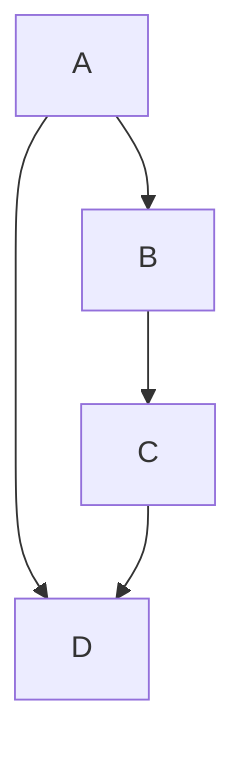
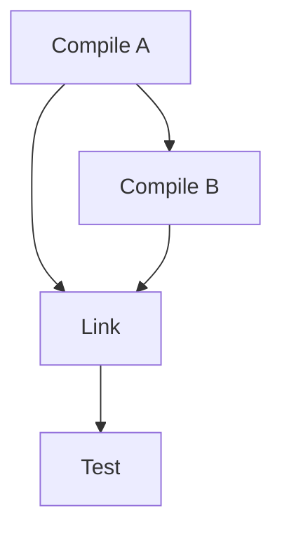
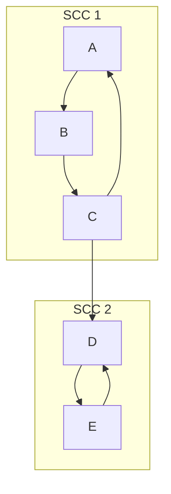
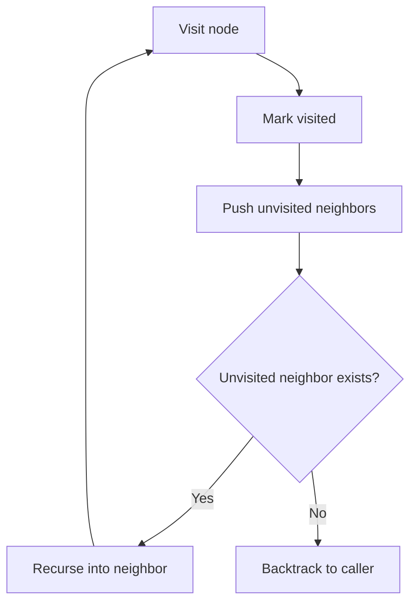
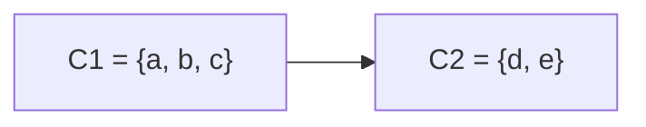
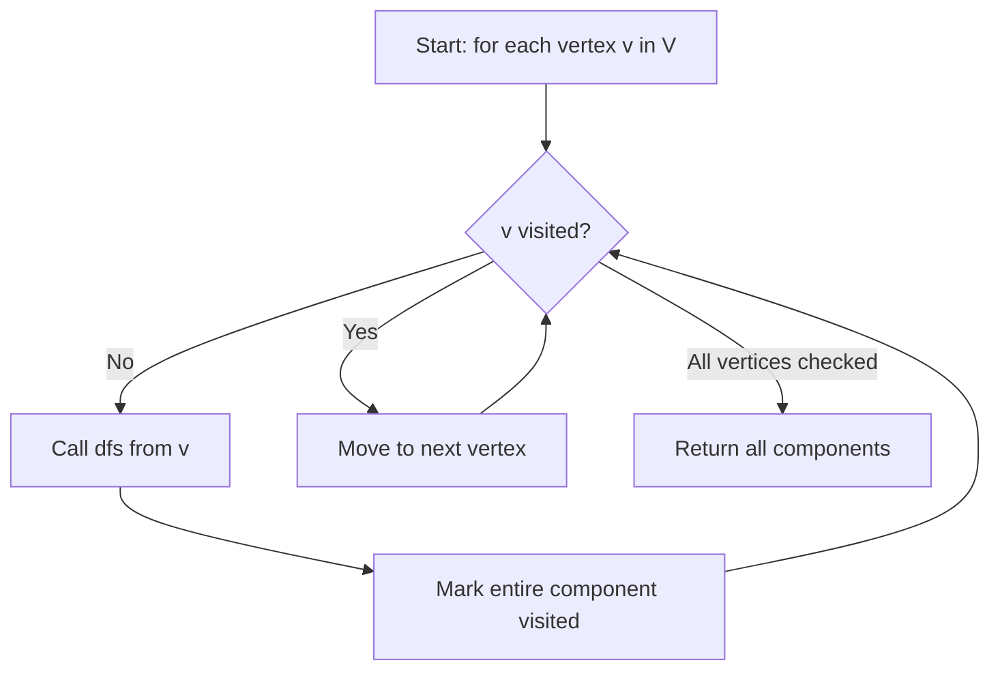
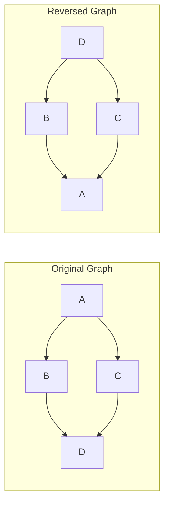
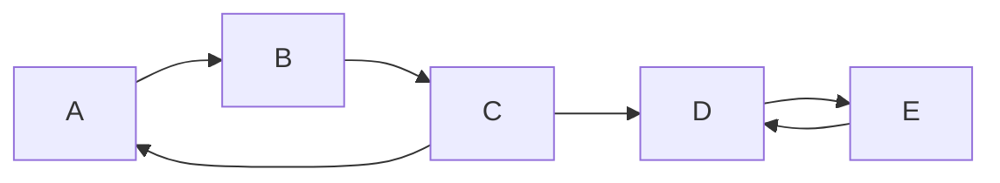

# SPL Run: build_concept_book

- **Adapter:** claude_cli
- **Model:** claude-sonnet-5
- **Tokens:** 10106 in / 6343 out
- **Latency:** 141650ms
- **Timestamp:** 2026-09-27 12:19:26

## Output

```output


---

## Reachability

A vertex $v$ is **reachable** from vertex $u$ in a directed graph $G = (V, E)$ if there exists a directed path — a sequence of edges $u \to v_1 \to v_2 \to \cdots \to v$ — following edge directions consistently. The **reachability set** of $u$, written $\text{reach}(u)$, is the set of all vertices reachable from $u$, including $u$ itself by convention (via the empty path). Formally, $\text{reach}(u)$ is the closure of $\{u\}$ under the edge relation $E$.

Reachability is not symmetric: $v \in \text{reach}(u)$ does not imply $u \in \text{reach}(v)$, since edges have direction. This distinguishes directed reachability from connectivity in undirected graphs, where a single traversal determines mutual reachability for an entire component.

**Worked example.** Consider a graph with edges $A \to B$, $B \to C$, $A \to D$, $C \to D$. Starting from $A$: we can reach $B$ directly, then $C$ from $B$, then $D$ from $C$ or directly from $A$. So $\text{reach}(A) = \{A, B, C, D\}$. But $\text{reach}(D) = \{D\}$, since $D$ has no outgoing edges — nothing is reachable from $D$ except itself.

**Computing reachability.** $\text{reach}(u)$ is computed by graph traversal — breadth-first search (BFS) or depth-first search (DFS) starting at $u$ — marking each visited vertex. Both run in $O(V + E)$ time, since each vertex is visited once and each edge examined once. This is the key algorithmic fact: reachability from a single source is linear in graph size, not exponential, even though the *number* of possible paths can be exponential. The traversal never needs to enumerate paths — it only needs to track visited status.

For problem-solving, reachability underlies many practical questions: Can data flow from module $X$ to module $Y$ in a dependency graph? Is there a route from city $A$ to city $B$ in a one-way road network? Is a state reachable in a finite-state machine (relevant to verifying whether a bug state can ever occur)? Each reduces to a BFS/DFS from the source vertex, checking whether the target lies in the resulting reachability set.



*Directed graph illustrating reach(A) = {A, B, C, D}, while reach(D) = {D} since D has no outgoing edges.*

When reachability must be queried repeatedly across many source-target pairs, precomputing the full **transitive closure** — a $|V| \times |V|$ matrix where entry $(i,j)$ is true if $j \in \text{reach}(i)$ — trades $O(V^3)$ preprocessing (via Floyd–Warshall) for $O(1)$ per query, a classic space-time tradeoff in algorithm design.

---

## Dag

A directed acyclic graph (DAG) is a directed graph $G = (V, E)$ in which no sequence of edges starting and ending at the same vertex exists — formally, there is no directed path $v_1 \to v_2 \to \cdots \to v_k \to v_1$. This acyclicity is the property that makes DAGs computationally tractable: it guarantees the existence of at least one **topological ordering**, a linear sequence of vertices $v_1, \dots, v_n$ such that for every edge $(v_i, v_j) \in E$, $i < j$ in the ordering. A **source** is a vertex with in-degree 0 (no incoming edges); a **sink** has out-degree 0. Every finite DAG has at least one source and one sink — a fact used directly in the standard construction algorithm.

**Worked example.** Consider a build system with tasks: compile A, compile B (depends on A), link (depends on A and B), and test (depends on link). The dependency graph has edges $A \to B$, $A \to \text{link}$, $B \to \text{link}$, $\text{link} \to \text{test}$. Kahn's algorithm produces a topological order by repeatedly removing a source: start with $A$ (only vertex with in-degree 0), remove it and decrement in-degrees of its neighbors — $B$ now has in-degree 0, remove it, then $\text{link}$, then $\text{test}$. The resulting order $A, B, \text{link}, \text{test}$ is a valid build sequence: every task runs only after its prerequisites.

**Problem-solving application.** Topological sorting runs in $O(V + E)$ time via Kahn's algorithm (repeatedly strip sources) or via depth-first search (record finish times, then reverse). A key theorem: a directed graph has a topological ordering if and only if it is acyclic. This gives a practical cycle-detection test — if Kahn's algorithm terminates without processing all vertices, a cycle exists among the unprocessed set, which is exactly how tools like `make`, package managers, and spreadsheet formula engines detect circular dependencies. DAGs also underlie dynamic programming: solving subproblems in topological order guarantees every subproblem's dependencies are resolved before it is computed, and the DAG's longest path corresponds to critical-path scheduling problems in project management.


*A dependency DAG: A is the source, T (test) is the sink, and edges flow strictly downward following build order.*

---

## Strong Connectivity

In a directed graph, an edge from $u$ to $v$ does not guarantee an edge (or even a path) back from $v$ to $u$. **Strong connectivity** captures when two-way reachability holds. Vertices $u$ and $v$ are strongly connected if there exists a directed path from $u$ to $v$ *and* a directed path from $v$ to $u$. This relation — call it $u \sim v$ — is an equivalence relation: it is reflexive (a vertex trivially reaches itself), symmetric by definition, and transitive (if $u$ reaches $v$ and $v$ reaches $w$, concatenating paths shows $u$ reaches $w$, and similarly in reverse). Because $\sim$ is an equivalence relation, it partitions the vertex set into disjoint equivalence classes called **strongly connected components (SCCs)**. Within one SCC, every vertex can reach every other vertex; between two different SCCs, at best only one direction of reachability can hold.

**Worked example.** Consider a directed graph with edges $A \to B$, $B \to C$, $C \to A$, and $C \to D$. Vertices $A$, $B$, $C$ form a cycle, so each can reach the other two — they form one SCC, $\{A, B, C\}$. Vertex $D$ has no outgoing edge back into the cycle, so it cannot reach $A$, $B$, or $C$; it forms its own singleton SCC, $\{D\}$. Notice the edge $C \to D$ crosses between components in only one direction — this is the "bridge" that links two SCCs without merging them.

**Problem-solving application.** If you collapse each SCC into a single "super-vertex," the resulting graph — called the **condensation** — is guaranteed to be a directed acyclic graph (DAG). This is a powerful algorithmic move: many problems on directed graphs with cycles (e.g., finding the minimum edges to make a graph strongly connected, or scheduling tasks with circular dependencies) become tractable once reduced to a DAG. Algorithms like Tarjan's or Kosaraju's compute all SCCs in linear time, $O(V + E)$, making this decomposition practical even for large graphs.



*Two strongly connected components, each a dense mutually-reachable cluster, linked by a single one-way bridge edge from SCC 1 to SCC 2.*

---

## Depth First Search

Depth-first search (DFS) is a graph traversal algorithm that explores as deeply as possible along one branch before backtracking to try another. Starting from a source vertex $v$, DFS visits an unvisited neighbor, marks it, and recursively repeats the process from that neighbor. When a vertex has no unvisited neighbors left, the algorithm backtracks to the most recent vertex with unexplored options — a pattern naturally implemented with a stack (explicit or via recursion's call stack).

Formally, for a graph $G = (V, E)$, DFS maintains a set $\text{visited} \subseteq V$ and a recursive procedure:

$$
\text{DFS}(v):\quad \text{visited} \leftarrow \text{visited} \cup \{v\}; \quad \text{for each } u \in \text{adj}(v): \text{ if } u \notin \text{visited}, \text{ call DFS}(u)
$$

Each vertex is visited exactly once and each edge examined at most twice (once from each endpoint in an undirected graph), giving a time complexity of $O(|V| + |E|)$ — linear in the size of the graph. This efficiency, combined with the order in which vertices are discovered and finished, makes DFS a building block for many other algorithms: detecting cycles, finding connected components, computing topological orderings of directed acyclic graphs, and identifying strongly connected components (Tarjan's and Kosaraju's algorithms).

**Worked example.** Consider a graph with edges $A\!-\!B$, $A\!-\!C$, $B\!-\!D$, $C\!-\!D$. Starting DFS at $A$: visit $A$, mark it, move to neighbor $B$; visit $B$, mark it, move to neighbor $D$; visit $D$, mark it, move to neighbor $C$; visit $C$, mark it — no unvisited neighbors remain, so backtrack all the way to $A$, which also has no unvisited neighbors left. The visitation order is $A, B, D, C$, and the recursive call stack at the deepest point holds $A \to B \to D \to C$, four nested frames.

**Problem-solving application.** DFS answers reachability and structural questions efficiently: "Is there a path from $A$ to $C$?" reduces to checking whether $C$ becomes marked. To detect a cycle in an undirected graph, track each vertex's parent in the recursion; if DFS reaches an already-visited vertex that is not the current parent, a cycle exists. For maze-solving or puzzle search spaces, DFS is preferred over breadth-first search when memory is constrained, since it only needs to store the current path, not every frontier vertex.


*The DFS control flow: each recursive call corresponds to a nested frame on the call stack, unwound only once a vertex's neighbors are exhausted.*

---

## Strong Component Graph

**Definition.** Let $G = (V, E)$ be a directed graph, and let $C_1, C_2, \ldots, C_k$ be its strongly connected components (SCCs) — the maximal subsets of vertices where every vertex can reach every other vertex within the same subset. The **strong component graph** (also called the *condensation* of $G$, denoted $G^{SCC}$) is formed by contracting each $C_i$ into a single vertex $v_i$, and drawing an edge $v_i \to v_j$ whenever $G$ contains at least one edge from a vertex in $C_i$ to a vertex in $C_j$ (with $i \neq j$), collapsing any duplicate edges into one.

**Theorem.** For any directed graph $G$, the condensation $G^{SCC}$ is a directed acyclic graph (DAG).

**Proof sketch.** Suppose $G^{SCC}$ contained a cycle $v_1 \to v_2 \to \cdots \to v_m \to v_1$. Each edge $v_i \to v_{i+1}$ corresponds to a path in $G$ from some vertex in $C_i$ to some vertex in $C_{i+1}$. Since each $C_i$ is internally strongly connected, we can walk from any vertex of $C_i$ to any other vertex of $C_i$. Chaining these paths together produces a closed walk visiting every vertex in $C_1, \ldots, C_m$, meaning any vertex in $C_1$ can reach any vertex in $C_2$ and vice versa. This makes $C_1 \cup C_2 \cup \cdots \cup C_m$ mutually reachable — a single strongly connected set — contradicting the maximality of each $C_i$ as a *separate* SCC. Hence no cycle can exist. $\blacksquare$

**Worked example.** Consider $G$ with vertices $\{a, b, c, d, e\}$ and edges $a\to b$, $b \to c$, $c \to a$, $c \to d$, $d \to e$, $e \to d$. Running Tarjan's or Kosaraju's algorithm identifies $C_1 = \{a, b, c\}$ and $C_2 = \{d, e\}$. The condensation has two vertices, $v_1$ (for $C_1$) and $v_2$ (for $C_2$), with a single edge $v_1 \to v_2$ (from the original edge $c \to d$), collapsing what would have been one edge into the DAG.

**Problem-solving application.** The DAG-ness of $G^{SCC}$ is what makes it computationally powerful: once you condense a graph, you can run any DAG algorithm — topological sort, longest path, dynamic programming — on the condensation instead of the original graph. This is the key step in solving problems like "find the minimum number of edges to add so that $G$ becomes strongly connected" (count source and sink components in $G^{SCC}$) or "determine reachability queries efficiently" (compute reachability once on the smaller DAG rather than on $G$).


*The condensation collapses each strongly connected component into a single node, producing an acyclic graph.*

---

## Dfs Wrapper

A single call to depth-first search only explores the connected component containing its starting vertex. If a graph has multiple components — for example, a social network with isolated clusters, or a road map with disconnected regions — one DFS call leaves the rest of the graph untouched. The **DFS wrapper** solves this by iterating over every vertex in the graph and launching a fresh DFS from any vertex not yet visited, guaranteeing that all vertices, across all components, are eventually explored.

The wrapper maintains one shared `visited` set across all calls. For each vertex $v$ in the vertex set $V$, it checks whether $v$ has been visited; if not, it calls `dfs(v)`, which recursively visits $v$'s entire component before returning control to the wrapper.

```
def dfs_wrapper(graph):
    visited = set()
    components = []
    for v in graph.vertices:
        if v not in visited:
            component = []
            dfs(graph, v, visited, component)
            components.append(component)
    return components

def dfs(graph, v, visited, component):
    visited.add(v)
    component.append(v)
    for neighbor in graph.neighbors(v):
        if neighbor not in visited:
            dfs(graph, neighbor, visited, component)
```

Consider a graph with vertices $\{1,2,3,4,5,6\}$ and edges forming two components: $\{1,2,3\}$ and $\{4,5,6\}$. Iterating vertices in order, the wrapper starts DFS at vertex 1, visiting $\{1,2,3\}$. Vertex 4 is the next unvisited vertex, so DFS restarts there, visiting $\{4,5,6\}$. The wrapper returns two components — the correct decomposition of the graph.

This pattern is the standard method for computing **connected components** (undirected graphs) or performing a full **topological sort** and **cycle detection** (directed graphs), since both require visiting every vertex regardless of how many disconnected pieces the graph contains. Because each vertex is visited exactly once and each edge examined at most twice, the wrapper preserves DFS's overall $O(|V| + |E|)$ time complexity — the outer loop adds only $O(|V|)$ overhead for the visited-checks, not a new asymptotic cost.


*The wrapper loop restarts DFS at each unvisited vertex until the whole graph, including disconnected components, has been traversed.*

When solving problems, always check whether a graph might be disconnected before writing a single DFS call — the wrapper is what makes DFS a complete graph-traversal algorithm rather than a component-local one.

---

## Graph Reversal

Given a directed graph $G = (V, E)$, the **reverse graph** (also called the transpose) $G^R = (V, E^R)$ has the same vertex set but every edge direction flipped: $(u, v) \in E \iff (v, u) \in E^R$. Reversal is a purely structural transformation — it changes no vertex, adds no new connectivity information, and can be computed in $O(V + E)$ time by scanning the adjacency list once and inserting each edge into the opposite direction's list.

Reversal matters because certain properties of a DAG are easier to compute in one direction than the other. A canonical use case: suppose you want to process the DAG in forward topological order using a DFS-based postorder trick. A plain DFS postorder gives you a valid order for *reverse* topological processing (finish times decrease from sinks to sources). To get the forward order directly via DFS traversal semantics, you instead run DFS on $G^R$ and read off finishing order — because "last to finish in $G^R$" corresponds to "first in topological order of $G$."

Worked example: let $G$ have edges $A \to B$, $A \to C$, $B \to D$, $C \to D$. Then $G^R$ has edges $B \to A$, $C \to A$, $D \to B$, $D \to C$. In $G$, $A$ is a source and $D$ is a sink; in $G^R$, those roles swap — $D$ becomes the source and $A$ the sink. This role-swap is the entire content of reversal: sources become sinks, sinks become sources, and every path $u \rightsquigarrow v$ in $G$ becomes a path $v \rightsquigarrow u$ in $G^R$.

The most important algorithmic payoff appears in **Kosaraju's algorithm** for finding strongly connected components. It runs DFS on $G$ to compute finishing times, reverses the graph, then runs DFS on $G^R$ processing vertices in decreasing order of finish time. Each DFS tree produced in this second pass is exactly one strongly connected component. The correctness argument hinges on a key lemma: if $C_1$ and $C_2$ are distinct SCCs with an edge from $C_1$ to $C_2$ in $G$, then the vertex with the latest finish time overall must lie in $C_1$ — a fact that reverses cleanly to guarantee the second DFS never "leaks" across components. When implementing this, a common bug is forgetting that adjacency-list reversal must preserve edge weights or metadata if the algorithm downstream (e.g., computing shortest paths on $G^R$) depends on them.


*Reversing every edge in $G$ turns source $A$ into a sink and sink $D$ into a source in $G^R$.*

---

## Sink Source Component

In the component graph $G^{SCC}$ formed by contracting each strongly connected component (SCC) of a directed graph $G$ into a single node, every node has a well-defined in-degree and out-degree. A **source component** is an SCC with in-degree 0 in $G^{SCC}$ — no edges enter it from any other component. A **sink component** is an SCC with out-degree 0 — no edges leave it. Because $G^{SCC}$ is always a DAG (contracting cycles removes all cycles by construction), every DAG has at least one source and at least one sink, so every graph with at least one SCC has at least one source component and one sink component.

This structural fact is the engine behind linear-time SCC algorithms. Kosaraju's algorithm exploits it directly: run a depth-first search (DFS) on $G$ and record finishing times; the vertex with the *last* finishing time lies in a source component of $G^{SCC}$. Then run DFS on the transpose graph $G^T$ (all edges reversed) starting from that vertex, in decreasing order of finishing time. Reversing edges swaps sources and sinks, so this second pass peels off one component at a time, always discovering a sink component of the *current* $G^{SCC}$ first — guaranteeing the DFS tree in $G^T$ never leaks into an already-processed component.

**Worked example.** Consider $G$ with edges $A \to B$, $B \to A$, $B \to C$, $C \to D$, $D \to C$. The SCCs are $\{A,B\}$ and $\{C,D\}$, with a single edge $\{A,B\} \to \{C,D\}$ in $G^{SCC}$. Here $\{A,B\}$ is the source component (in-degree 0) and $\{C,D\}$ is the sink component (out-degree 0). A DFS from $A$ finishes $C$ or $D$ last only after finishing $A,B$ last relative to $\{C,D\}$ — so the last-finished vertex overall lies in $\{A,B\}$, correctly identifying the source. Running DFS on $G^T$ from that vertex recovers exactly $\{A,B\}$ before touching $\{C,D\}$.

**Problem-solving application.** When asked to find *any* sink component without computing the full SCC decomposition, pick an arbitrary vertex, follow outgoing edges greedily (never backtracking to already-visited components), and the last SCC reached before getting stuck is necessarily a sink — this shortcut is useful in Tarjan's algorithm, where sink components are identified and popped off the DFS stack as soon as a node's low-link value equals its own DFS index.

---

## Kosaraju Sharir Algorithm

A strongly connected component (SCC) of a directed graph is a maximal set of vertices where every vertex can reach every other vertex along directed edges. Kosaraju's algorithm (independently discovered by Sharir) finds all SCCs in $O(V + E)$ time using two depth-first search (DFS) passes: one on the graph, one on its reverse.

The key insight relies on *finishing times*. If DFS is run on the whole graph and finishing times recorded, then processed in decreasing order of finishing time on the **reversed** graph $G^R$ (all edges flipped), each DFS tree produced in $G^R$ corresponds exactly to one SCC. The proof rests on a lemma: if $C$ and $C'$ are distinct SCCs with an edge from $C$ to $C'$ in $G$, then the maximum finishing time in $C$ exceeds the maximum finishing time in $C'$. This ordering guarantees that starting DFS from the SCC with the latest finishing time in $G^R$ never "leaks" into a different component, because any edge leaving that component in $G^R$ points to a component already fully explored.

**Algorithm steps:**
1. Run DFS on $G$, pushing each vertex onto a stack when it finishes (postorder).
2. Compute $G^R$ by reversing every edge.
3. Pop vertices from the stack; for each unvisited vertex, run DFS on $G^R$. Each resulting DFS tree is one SCC.

**Worked example:** Consider $G$ with edges $A \to B$, $B \to C$, $C \to A$, $C \to D$, $D \to E$, $E \to D$. DFS on $G$ might finish in order $A, B, C, D, E$ (stack top = $A$ after reversing push order, i.e., last finished pushed last, so pop order is $E, D, C, B, A$ — the implementation detail is to push on finish and pop from the top). Reversing gives $B \to A$, $C \to B$, $A \to C$, $D \to C$, $E \to D$, $D \to E$. Popping in decreasing finish-time order and running DFS on $G^R$ recovers $\{A, B, C\}$ as one SCC and $\{D, E\}$ as another — matching the two visible cycles in the original graph.

**Problem-solving application:** SCC decomposition is the standard first step in analyzing dependency graphs, compiler control-flow graphs, and web-link structures. To check whether a directed graph is a single SCC (i.e., every vertex reachable from every other), run Kosaraju's algorithm once and confirm exactly one component of size $V$ — no need for $V^2$ pairwise reachability checks.


*A directed graph with two strongly connected components: {A, B, C} and {D, E}, linked by the edge C→D.*

---

## Payoff

Kosaraju–Sharir's algorithm answers a deceptively simple question about a directed graph: which vertices can reach each other, and which can't? Two vertices $u$ and $v$ belong to the same strongly connected component (SCC) if a directed path exists from $u$ to $v$ *and* from $v$ to $u$. The algorithm finds every such component in $O(V + E)$ time using two depth-first searches — one on the graph, one on its transpose (edges reversed), ordered by finishing times from the first pass. This linear-time guarantee is not incidental; it is the payoff of everything the course has built toward: DFS traversal, finishing-time ordering, graph transposition, and the topological insight that SCCs, once contracted, form a DAG. Kosaraju–Sharir is the natural capstone because it demonstrates how these separately-taught tools compose into a single elegant, provably correct algorithm — a microcosm of algorithmic thinking itself.

Consider a directed graph modeling a communication network: edges represent one-way message channels. Two servers are mutually redundant only if messages can flow both directions, possibly through intermediaries. Running Kosaraju–Sharir on a 10,000-node network in milliseconds tells you exactly which server clusters are mutually resilient and which are single points of failure — information no amount of manual inspection could reliably produce.

This algorithm is the connective tissue for higher-level reasoning about directed structure. In compiler design, SCC detection identifies mutually recursive functions or circular module dependencies that must be compiled or linked together. In web-scale graph analysis, it reveals the "core" of the web — the giant strongly connected component through which most navigable paths pass — distinguishing it from purely inbound or outbound fringe pages. In social network analysis, SCCs expose reciprocal influence clusters, distinct from one-directional follower relationships. In circuit and dependency analysis, they flag feedback loops that must be resolved before a system can be evaluated in a well-defined order. In each domain, the underlying question is identical — where does mutual reachability create an indivisible unit? — and the answer is computed once, generically, and reused everywhere.

As a next step, explore the compiler dependency-resolution application in depth: build a small module-import graph, run Kosaraju–Sharir to detect circular imports, then contract each SCC into a single node and topologically sort the resulting DAG to determine a valid compilation order.
```
