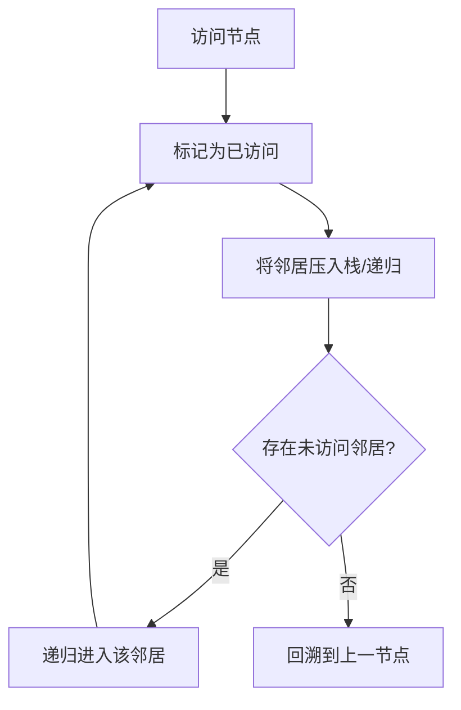
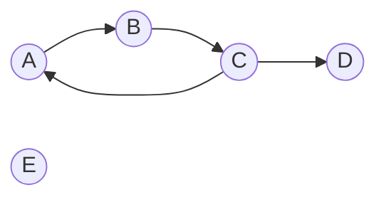
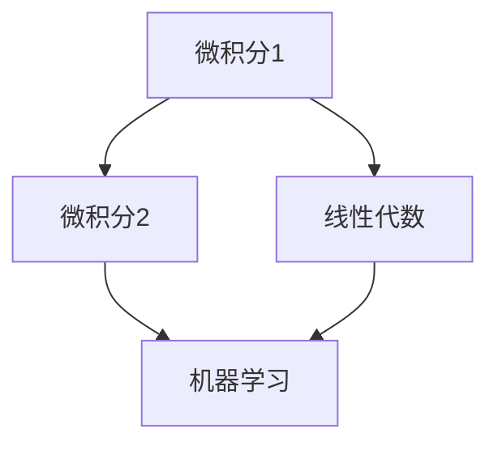
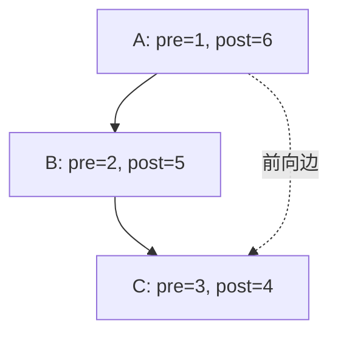
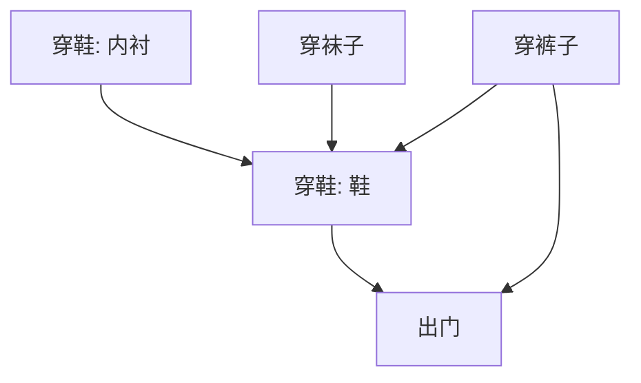

# SPL Run: build_concept_book

- **Adapter:** claude_cli
- **Model:** claude-sonnet-5
- **Tokens:** 5900 in / 1693 out
- **Latency:** 137638ms
- **Timestamp:** 2026-09-27 20:32:05

## Output

```output


---

## Depth First Search

**定义**

深度优先搜索(Depth First Search, DFS)是一种图遍历算法：从起始节点出发，沿着某条分支尽可能深入地探索，直到无法继续前进（即当前节点的所有邻居都已访问过）才回溯到上一个节点，尝试其他分支。这种"一条路走到黑，再回头"的策略天然适合用递归实现，因为递归调用栈本身就充当了回溯所需的"记忆"。DFS 需要一个 `visited` 集合来标记已访问节点，防止在有环图中无限循环。其时间复杂度为 $O(V + E)$，其中 $V$ 为节点数，$E$ 为边数，因为每个节点和每条边最多被检查一次。

**递归实现**

```python
def dfs(graph, node, visited=None):
    if visited is None:
        visited = set()
    visited.add(node)
    print(node)  # 访问节点
    for neighbor in graph[node]:
        if neighbor not in visited:
            dfs(graph, neighbor, visited)
    return visited
```

以图 $A \to B, A \to C, B \to D, C \to D$ 为例，从 $A$ 出发：访问 $A$，标记；进入邻居 $B$，标记；$B$ 的邻居 $D$ 未访问，进入并标记；$D$ 无未访问邻居，回溯到 $B$，$B$ 也无其他未访问邻居，回溯到 $A$；接着访问 $C$，其邻居 $D$ 已标记，跳过，回溯结束。访问顺序为 $A, B, D, C$。

**问题求解应用**

DFS 是解决"连通性"与"路径存在性"问题的核心工具。例如判断有向图中是否存在环：在递归过程中维护一个"当前递归栈"集合（区别于全局 `visited`），若在深入探索时遇到已在当前栈中的节点，则说明存在环——这正是编译器检测循环依赖、构建系统检测循环导入的基本原理。DFS 还是拓扑排序（topological sort）的基础：节点在递归返回（即所有子节点处理完毕）时被压入结果栈，最终栈的逆序即为拓扑序。



*该图展示深度优先搜索的核心循环：访问、标记、递归深入，直至无路可走时回溯。*

---

## 可达性（Reachability）

在有向图 $G = (V, E)$ 中，若存在一条从顶点 $u$ 到顶点 $v$ 的有向路径（即一系列边 $u \to v_1 \to v_2 \to \cdots \to v$），则称 $v$ 从 $u$ **可达**，记作 $u \rightsquigarrow v$。特别地，规定 $u$ 总能到达自身（路径长度为零）。给定起点 $u$，其**可达集** $\text{reach}(u)$ 定义为所有从 $u$ 出发能够到达的顶点集合：

$$\text{reach}(u) = \{ v \in V \mid u \rightsquigarrow v \}$$

可达性是一种关系，而不是一个数值；它回答的是"能不能到"的问题，而不是"多远"的问题——这一点与最短路径不同。

**求解方法**：计算 $\text{reach}(u)$ 的标准做法是从 $u$ 出发做一次图遍历（BFS 或 DFS），并记录所有被访问过的顶点。算法复杂度为 $O(|V| + |E|)$，因为每个顶点最多入队一次，每条边最多被检查一次。

```python
def reach(graph, u):
    visited = {u}
    stack = [u]
    while stack:
        node = stack.pop()
        for neighbor in graph[node]:
            if neighbor not in visited:
                visited.add(neighbor)
                stack.append(neighbor)
    return visited
```

**应用场景**：可达性分析广泛用于依赖检测（某个模块是否间接依赖另一个模块）、网络连通性诊断、编译器中的死代码检测（从程序入口不可达的代码即为死代码），以及社交网络中的影响力传播分析。

**问题求解练习**：给定顶点集 $\{A, B, C, D, E\}$ 和边集 $\{A \to B, B \to C, C \to A, C \to D\}$，求 $\text{reach}(A)$。从 $A$ 出发，可达 $B$；从 $B$ 可达 $C$；从 $C$ 可达 $A$（已访问）和 $D$。因此 $\text{reach}(A) = \{A, B, C, D\}$，而 $E$ 不可达，因为没有指向 $E$ 的边。注意 $A, B, C$ 互相可达（构成一个环），这种"双向可达"的顶点集合正是后续要学习的**强连通分量**概念的基础。



*图示：从顶点 A 出发，沿有向边遍历，$\text{reach}(A) = \{A, B, C, D\}$；顶点 E 无法从 A 到达。*

---

## Dag

有向无环图（Directed Acyclic Graph，DAG）是一种有向图，其中不存在任何一条从某个顶点出发、沿边方向前进最终又回到该顶点的路径。换句话说，DAG 中不存在"环"——你不可能沿着边的方向兜一圈回到起点。这个性质使 DAG 具备了一个关键的结构特征：**拓扑排序**（topological ordering）的存在性。图中入度为零的顶点称为"源点"（source），出度为零的顶点称为"汇点"（sink）；一个有向图是无环的，当且仅当它至少存在一种拓扑排序——即可以把所有顶点排成一个线性序列，使得每条边都从序列中靠前的顶点指向靠后的顶点。

**判定与构造：Kahn 算法**
判断一个图是否为 DAG，并同时求出其拓扑序，最经典的方法是 Kahn 算法：
1. 统计每个顶点的入度，将所有入度为 0 的顶点放入队列。
2. 每次从队列取出一个顶点，加入输出序列，并将其所有出边指向的顶点入度减 1；若某顶点入度减为 0，则加入队列。
3. 重复直到队列为空。若最终输出序列包含了图中全部顶点，则该图是 DAG；若有顶点未被输出（说明它们被困在某个环中，入度永远无法降到 0），则图中存在环。

该算法的时间复杂度为 $O(V + E)$，其中 $V$ 为顶点数、$E$ 为边数——每个顶点入队出队各一次，每条边只被处理一次。

**问题求解应用**
考虑一门课程体系：`微积分1 → 微积分2`，`微积分1 → 线性代数`，`线性代数 → 机器学习`，`微积分2 → 机器学习`。这是一个 DAG，源点是"微积分1"，汇点是"机器学习"。对其做拓扑排序即可得到一个合法的选课顺序，例如：微积分1、微积分2、线性代数、机器学习。DAG 结构同样是任务调度（如 `make`、CI/CD 流水线）、区块链账本结构（部分变种）以及电路设计中信号依赖分析的基础模型：只要问题能被抽象为"任务/状态依赖某些前置任务/状态"，就应检验依赖关系图是否无环，再用拓扑排序确定可行的执行顺序。


*该图展示一个课程依赖的有向无环图：源点"微积分1"位于顶部无入边，汇点"机器学习"位于底部无出边，所有边严格向下流动，体现合法的拓扑顺序。*

---

## Preorder Postorder

**定义**

在深度优先搜索（DFS）中，我们维护一个全局计时器 $\text{clock}$，每当发生一次入栈或出栈事件，计时器就递增 $1$。对图或树中的每个顶点 $v$，定义两个时间戳：

$$
\text{pre}(v) = \text{clock 在 } v \text{ 被压入递归栈（即首次访问）时的值}
$$
$$
\text{post}(v) = \text{clock 在 } v \text{ 从递归栈弹出（即所有邻居都已访问完毕）时的值}
$$

由于 DFS 的递归结构，任意两个顶点 $u, v$ 的区间 $[\text{pre}(u), \text{post}(u)]$ 与 $[\text{pre}(v), \text{post}(v)]$ 之间只有两种可能关系：**完全嵌套**（其中一个是另一个的祖先/后代）或**完全不相交**（两者互不为祖先）。这条性质称为“括号定理”（Parenthesis Theorem），是理解 DFS 生成树结构的核心。

**求解示例**

考虑有向图 $A \to B \to C$，$A \to C$。从 $A$ 出发做 DFS：

- 访问 $A$：$\text{pre}(A)=1$
- 访问 $B$：$\text{pre}(B)=2$
- 访问 $C$：$\text{pre}(C)=3$，$C$ 无未访问邻居，弹出：$\text{post}(C)=4$
- $B$ 无其他邻居，弹出：$\text{post}(B)=5$
- $A$ 的邻居 $C$ 已访问，弹出：$\text{post}(A)=6$

区间为 $A:[1,6]$、$B:[2,5]$、$C:[3,4]$，完全嵌套，印证了 $A$ 是 $B$、$C$ 的祖先。

**应用：边分类**

pre/post 时间戳最直接的用途是在 $O(V+E)$ 时间内对 DFS 遍历到的每条边分类，而无需额外遍历：

- **树边/前向边**：$\text{pre}(u) < \text{pre}(v) < \text{post}(v) < \text{post}(u)$
- **反向边**（说明存在环）：$\text{pre}(v) < \text{pre}(u) < \text{post}(u) < \text{post}(v)$
- **横叉边**：区间不相交，$\text{post}(v) < \text{pre}(u)$

这正是判断有向图中是否存在环、以及拓扑排序算法（按 $\text{post}$ 值降序排列顶点）正确性的理论基础。



*图示：DFS 时钟为每个顶点打上 pre/post 时间戳，顶点区间的嵌套关系反映了递归栈的祖先—后代结构。*

---

## Topological Sort

**定义**　设 $G = (V, E)$ 为一个有向无环图（DAG，directed acyclic graph）。$G$ 的一个**拓扑排序**是顶点集合 $V$ 的一个线性排列，使得对每一条边 $(u, v) \in E$，$u$ 都排在 $v$ 之前。直观地说，如果边表示"依赖"或"必须先于"关系，拓扑排序给出一种不违反任何依赖关系的执行顺序。拓扑排序存在的充要条件是图中不含环——这也是"DAG"这个前提不可或缺的原因：只要图中有一个环，环上的顶点就无法被线性排序，因为环意味着某个顶点间接依赖于自己。

拓扑排序的标准算法基于**深度优先搜索（DFS）的后序遍历**：对图做一次 DFS，当一个顶点的所有邻居都已被访问完毕、即将从递归栈中退出时，把该顶点记录下来（后序，postorder）。把得到的后序序列**反转**，就是一个合法的拓扑排序。

**为什么反转后序有效**：考虑边 $(u, v)$。DFS 访问到 $u$ 时，如果 $v$ 还没被访问过，递归会先完全处理完 $v$（包括它所有的后代），$v$ 才会先于 $u$ 被记录进后序；如果 $v$ 已经访问过，由于图无环，$v$ 不可能仍在当前的递归栈中（否则会形成环），所以 $v$ 必然已经结束访问，也已被记录在 $u$ 之前。因此在后序序列中，$v$ 总是出现在 $u$ 之前。反转整个序列后，$u$ 就出现在 $v$ 之前，满足"边从早到晚"的要求。

**复杂度**：DFS 遍历每个顶点和每条边各一次，时间复杂度为 $O(|V| + |E|)$，与图的规模呈线性关系。

**求解应用**：拓扑排序的典型场景是任务调度——例如课程的先修关系、软件包的依赖安装顺序、编译过程中的模块依赖。给定"任务 A 必须在任务 B 之前完成"这样的一组约束，把它们建模成 DAG 后，拓扑排序直接给出一个可行的执行顺序。若算法在 DFS 过程中检测到"回边"（指向当前递归栈中顶点的边），则说明图中存在环，拓扑排序不存在——这本身也是一种实用的**环检测**手段。



*示例依赖图：穿衣顺序的 DAG，边表示"必须先于"关系；对该图做 DFS 后序遍历再反转，即可得到一个合法的穿衣顺序（如：穿裤子 → 穿袜子 → 穿鞋 → 出门）。*

---

## Payoff

拓扑排序解决的是一个看似简单却极为根本的问题：给定一个有向无环图 $G=(V,E)$，能否把所有顶点排成一个线性序列 $v_1, v_2, \dots, v_n$，使得对每条边 $(v_i, v_j) \in E$，$v_i$ 都排在 $v_j$ 之前？这个问题之所以是本书的终点，是因为它把前面学到的图遍历（DFS）、入度统计、队列/栈操作全部汇聚成一种"排序依赖关系"的通用能力——现实世界中几乎所有的任务调度、编译顺序、课程先修关系，本质上都是在问同一个问题：如何在满足约束的前提下线性化一个偏序结构。

**具体求解**：Kahn 算法给出了一个优雅的构造性证明——反复取出当前入度为 0 的顶点加入结果序列，并将其所有出边"移除"（即把邻居入度减一），直到图为空或无法继续（后者说明存在环，图不是 DAG）。该算法的正确性依赖于一个关键事实：一个有限的有向无环图必然至少存在一个入度为 0 的顶点，否则从任意点出发沿入边回溯必将成环，与"无环"矛盾。算法的时间复杂度为 $O(V+E)$，因为每个顶点入队一次、每条边被处理一次。

**与后续应用的连接**：拓扑排序真正的价值在于它是**动态规划**在图上求解的前提条件。动态规划要求"子问题先于原问题被求解"，而这恰恰就是拓扑序所保证的性质。例如在计算 DAG 上的最长路径（关键路径法，用于项目工期估算）或最短路径时，我们按拓扑序依次处理每个顶点，此时该顶点的所有前驱都已经计算完毕，状态转移方程

$$
\text{dp}[v] = \max_{(u,v) \in E} \big(\text{dp}[u] + w(u,v)\big)
$$

才能被正确、无遗漏地求值——这正是"无后效性"这一 DP 核心假设在图结构上的具体体现。可以说，没有拓扑排序提供的处理顺序，图上的动态规划就无从谈起。

现在，邀请你深入探索这一衔接点：尝试用拓扑排序 + 动态规划实现一个课程先修图上的"最长学习路径"求解器，体会顺序如何决定正确性。
```
