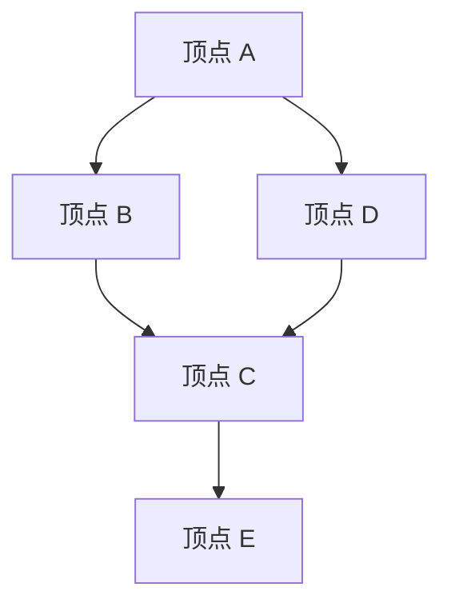
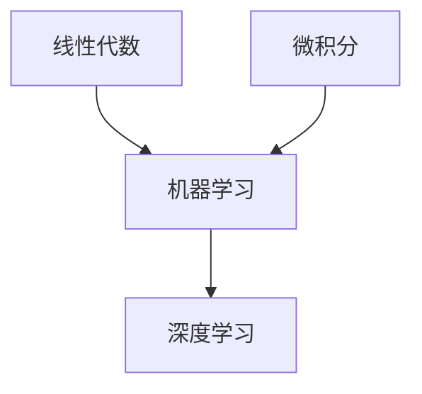
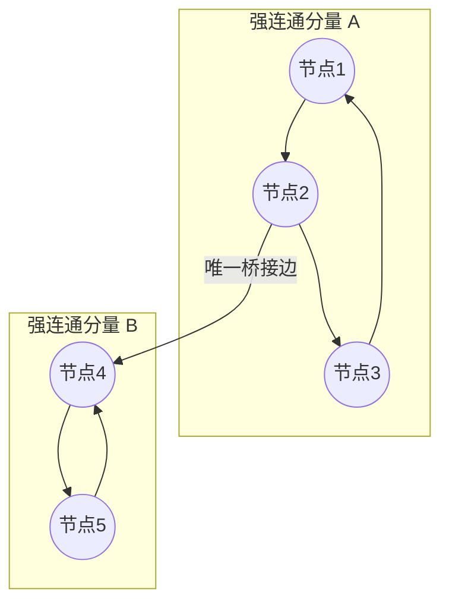
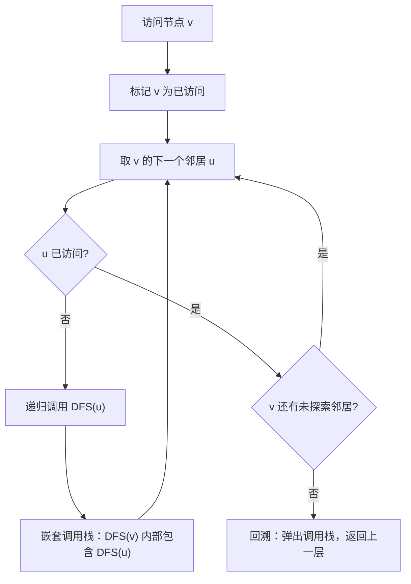
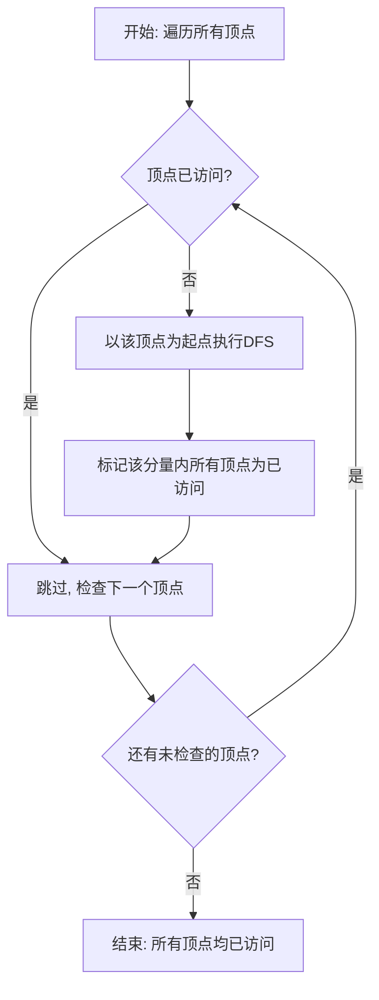
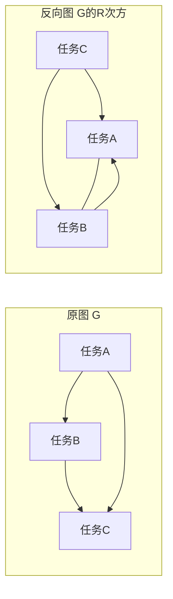

# SPL Run: build_concept_book

- **Adapter:** claude_cli
- **Model:** claude-sonnet-5
- **Tokens:** 10152 in / 2765 out
- **Latency:** 196323ms
- **Timestamp:** 2026-09-27 20:34:24

## Output

```output


---

## 可达性（Reachability）

在有向图 $G = (V, E)$ 中，若存在一条由边构成的路径 $u \to v_1 \to v_2 \to \cdots \to v$，则称顶点 $v$ 从顶点 $u$ **可达**，记作 $u \rightsquigarrow v$。特别地，规定每个顶点对自身可达（路径长度为 0）。给定起点 $u$，其**可达集**定义为

$$
\text{reach}(u) = \{ v \in V \mid u \rightsquigarrow v \}.
$$

可达性关系是自反、传递的，但通常不对称——这正是有向图区别于无向图的关键之处：在无向图中可达性等价于连通性，而在有向图中 $u$ 可达 $v$ 并不意味着 $v$ 可达 $u$。

**求解可达集**的标准方法是从 $u$ 出发做一次广度优先搜索（BFS）或深度优先搜索（DFS），把所有被访问到的顶点收集起来即为 $\text{reach}(u)$。设图有 $|V|$ 个顶点、$|E|$ 条边，邻接表存储下该算法的时间复杂度为 $O(|V| + |E|)$——每个顶点最多入队一次，每条边最多被扫描一次。

**例题**：给定有向图，边集为 $\{A\to B,\ B\to C,\ A\to D,\ D\to C,\ C\to E\}$。求 $\text{reach}(A)$。从 $A$ 出发做 BFS：第一层访问 $B, D$；第二层通过 $B\to C$ 和 $D\to C$ 访问 $C$（只记录一次）；第三层通过 $C\to E$ 访问 $E$。因此 $\text{reach}(A) = \{A, B, C, D, E\}$，而 $\text{reach}(C) = \{C, E\}$，说明可达集会随起点不同而显著缩小。

**应用**：可达性是许多实际问题的基础判据。例如编译器做“死代码检测”时，会计算从程序入口 `main` 出发的可达集，任何不在该集合中的函数或代码块都可以安全删除；网络路由分析中，判断数据包能否从节点 $A$ 送达节点 $Z$，本质上就是询问 $Z \in \text{reach}(A)$ 是否成立。当需要频繁查询任意两点间的可达性时，可预先计算**传递闭包**（对所有顶点对判定可达性的矩阵），代价是 $O(|V|^3)$（如 Floyd–Warshall 变体），用空间换时间。


*从顶点 A 出发的可达集 reach(A) = {A, B, C, D, E}，通过 BFS/DFS 遍历所有可达顶点得到。*

---

## Dag

**定义**：有向无环图（Directed Acyclic Graph，DAG）是一个有向图 $G = (V, E)$，其中不存在任何有向环——即不存在顶点序列 $v_1 \to v_2 \to \cdots \to v_k \to v_1$。DAG 的核心定理是：**一个有向图存在拓扑排序当且仅当它是无环的**。拓扑排序是顶点的一个线性排列 $v_{i_1}, v_{i_2}, \ldots, v_{i_n}$，使得对每条边 $(u, v) \in E$，$u$ 都排在 $v$ 之前。图中入度为零的顶点称为**源点**（source），出度为零的顶点称为**汇点**（sink）；每个非空 DAG 至少存在一个源点和一个汇点，这正是环无法存在的直接推论——若不存在入度为零的点，沿入边不断回溯必然形成环。

**求解方法（Kahn 算法）**：
1. 计算每个顶点的入度，将所有入度为 0 的顶点加入队列 $Q$。
2. 从 $Q$ 中取出顶点 $u$，加入排序结果，并将其所有邻居的入度减 1；若某邻居入度降为 0，加入 $Q$。
3. 重复直到 $Q$ 为空。若最终排序中的顶点数小于 $|V|$，说明图中存在环。

时间复杂度为 $O(|V| + |E|)$，因为每个顶点和每条边恰好被处理一次。

**应用示例**：设课程先修关系为边 $(A \to B)$ 表示"学完 A 才能学 B"。给定边集 $\{(线代 \to 机器学习),\ (微积分 \to 机器学习),\ (机器学习 \to 深度学习)\}$，运行 Kahn 算法：源点为「线代」「微积分」（入度 0），依次移除后「机器学习」入度降为 0 入队，最后「深度学习」入队。得到一个合法的选课顺序：线代、微积分、机器学习、深度学习。这一算法同样是任务调度、编译依赖解析（如 Makefile）、以及神经网络前向传播计算图执行顺序的基础。



*该图展示一个 DAG 示例：源点「线性代数」与「微积分」无入边，边严格向下流动至汇点「深度学习」，体现有效的拓扑顺序。*

---

## Strong Connectivity

**定义.** 在有向图 $G = (V, E)$ 中，若顶点 $u$ 到 $v$ 存在有向路径，且 $v$ 到 $u$ 也存在有向路径，则称 $u$ 与 $v$ **强连通**（strongly connected），记作 $u \leftrightarrow v$。可以验证这一关系满足自反性、对称性与传递性，因此是 $V$ 上的一个**等价关系**：自反性由长度为零的路径保证；对称性由定义直接得到；传递性则是因为若 $u \to v \to w$ 且 $w \to v \to u$ 均存在路径，拼接后即得 $u \to w$ 与 $w \to u$。作为等价关系，它自然把 $V$ 划分为若干互不相交的等价类，每一类称为一个**强连通分量**（Strongly Connected Component, SCC）：分量内部任意两点互达，分量之间的有向边则不能双向抵达。

**判定与算法.** 求 SCC 的经典算法有两种：Kosaraju 算法（两次 DFS，利用完成时间逆序）与 Tarjan 算法（单次 DFS，用 low-link 值与栈标记回边），二者时间复杂度均为 $O(|V| + |E|)$，因为每个顶点、每条边只被访问常数次。将每个 SCC 收缩为一个节点后，得到的**分量图**（condensation graph）必定是一个有向无环图（DAG）——这是强连通性理论中唯一必须以定理形式给出的结论。

**证明要点.** 假设分量图中存在环 $C_1 \to C_2 \to \cdots \to C_k \to C_1$，则任取 $u \in C_1, v \in C_2$，沿环可从 $u$ 到达 $v$ 再回到 $u$，说明 $u, v$ 本应属于同一等价类，与 $C_1 \ne C_2$ 矛盾。故分量图无环。

**问题求解应用.** 该 DAG 结构是许多算法的基础：编译器用它检测循环依赖并做拓扑排序调度；社交网络分析用它识别"互粉圈子"；2-SAT 问题的可满足性判定正是通过构造隐含图并检查每个变量与其否定是否落入同一 SCC 来完成的。


*图中两个稠密簇分别是强连通分量 A 和 B：簇内任意两节点互达；两簇之间只有一条单向"桥"边，因此无法反向到达，A 与 B 是分量图中的两个独立节点。*

---

## Depth First Search

深度优先搜索（Depth First Search，DFS）是一种图遍历算法：从起始节点出发，沿着某一条分支尽可能深入地探索，直到无法继续前进（所有邻居都已访问）为止，再回溯到上一个节点，尝试其他未探索的分支。这种"先深入、后回溯"的策略天然地用递归实现——每次递归调用对应向前探索一步，递归返回则对应回溯一步。算法维护一个 `visited` 集合以避免重复访问同一节点（否则在有环图中会陷入无限递归）。

伪代码如下：

$$
\text{DFS}(v):\quad \text{mark } v \text{ as visited}; \quad \text{for each neighbor } u \text{ of } v: \quad \text{if } u \text{ not visited, call DFS}(u)
$$

**递归调用栈的本质**：DFS 并不显式维护一个栈数据结构（除非用迭代版本实现），而是借助程序运行时自身的调用栈——每次递归调用会把当前节点的"未探索邻居列表"压入调用栈，直到某一层的邻居全部访问完毕，该层才从栈中弹出，控制权交还给上一层调用者。这正是"递归 = 隐式栈"这一编程范式的典型体现。

**复杂度分析**：设图有 $V$ 个顶点、$E$ 条边。每个顶点恰好被访问一次（标记为 visited），每条边最多被检查两次（有向图为一次）。因此时间复杂度为 $O(V + E)$，空间复杂度（递归调用栈深度）在最坏情况下为 $O(V)$（例如一条链状图）。

**问题求解应用**：假设要判断一个无向图是否连通，可以从任意一个顶点开始执行 DFS，遍历结束后检查 `visited` 集合是否覆盖了所有顶点——若是，则图连通。DFS 还是拓扑排序、检测环、寻找连通分量、求解迷宫路径等问题的核心工具：例如在迷宫求解中，节点是格子，边是相邻可通行的格子，DFS 沿一条路径深入，撞墙则回溯，直到找到出口或穷尽所有路径。



*该流程图展示了 DFS 的访问-标记-递归-回溯循环，以及递归调用如何形成嵌套的调用栈结构。*

---

## Strong Component Graph

**定义**

给定有向图 $G = (V, E)$，其强连通分量（Strongly Connected Component，SCC）将 $V$ 划分为若干个等价类 $C_1, C_2, \ldots, C_k$：同一分量内任意两点互相可达，不同分量间不必然互达。**强连通分量图**（记作 $G^{SCC}$）是这样构造的图：每个 $C_i$ 收缩为一个顶点 $v_i$；若原图中存在边 $(u, w) \in E$，且 $u \in C_i$，$w \in C_j$，$i \neq j$，则在 $G^{SCC}$ 中加入边 $(v_i, v_j)$；若多条原边落在同一对 $(v_i, v_j)$ 上，则合并为一条边（去除平行边），自环（$i=j$）一律丢弃。

**定理**：对任意有向图 $G$，其强连通分量图 $G^{SCC}$ 是一个有向无环图（DAG）。

**证明**：反证法。假设 $G^{SCC}$ 中存在环 $v_{i_1} \to v_{i_2} \to \cdots \to v_{i_m} \to v_{i_1}$。由构造规则，每条边 $v_{i_t} \to v_{i_{t+1}}$ 对应原图中一条从 $C_{i_t}$ 到 $C_{i_{t+1}}$ 的路径。将这些路径首尾相连，再利用同一分量内部的强连通性补全"跳转点"之间的路径，就得到了一条从 $C_{i_1}$ 出发、经过所有这些分量、最终回到 $C_{i_1}$ 的闭合路径。这意味着 $C_{i_1}, \ldots, C_{i_m}$ 中任意两点互相可达，因此它们本应属于同一个强连通分量，与 $C_{i_1}, \ldots, C_{i_m}$ 是不同分量的假设矛盾。故 $G^{SCC}$ 无环。$\blacksquare$

**求解应用**

这个定理是许多图算法的基石。例如 Kosaraju 算法和 Tarjan 算法的第二步，正是利用 $G^{SCC}$ 必为 DAG 这一性质，对分量图做拓扑排序，从而确定分量之间的处理顺序（如依赖分析、编译器中的模块加载顺序、社交网络中"影响力传播"的层级划分）。具体做法：先用 DFS 求出所有 SCC 并给每个分量编号，再按照上述规则构造 $G^{SCC}$（用哈希集合去重以避免平行边），最后对这个 DAG 跑标准拓扑排序算法，时间复杂度整体仍为 $O(V + E)$。

---

## Dfs Wrapper

**定义**

深度优先搜索（DFS）本身只能从一个起点出发，遍历该起点所在的**连通分量**（对有向图则是从该顶点可达的所有顶点）。但许多问题要求处理整个图，包括那些不连通的部分——例如统计连通分量个数、检测所有环、或对森林做拓扑排序。`dfs_wrapper` 正是为此设计的外层控制结构：它遍历图中的每一个顶点，只要该顶点尚未被访问过，就以它为起点调用一次 DFS。这样，无论图是否连通，也无论有多少个孤立分量，每个顶点最终都会被访问恰好一次。

**伪代码**

```
function dfs_wrapper(G):
    visited = {}  # 全局访问标记，跨越所有 DFS 调用共享
    for v in G.vertices:
        if v not in visited:
            dfs(v, visited)
```

关键点在于 `visited` 集合是**全局共享**的：它不会在每次调用 `dfs(v)` 后重置，否则会重复访问同一分量。

**正确性与复杂度**

正确性来自一个简单的不变量：外层循环结束时，`visited` 中包含且仅包含所有顶点，因为循环遍历了每个顶点一次，且只有未访问的顶点才会触发新一轮 DFS。设图有 $V$ 个顶点、$E$ 条边，用邻接表存储。外层 `for` 循环本身是 $O(V)$；而所有内层 DFS 调用加起来（不是每次单独算）总共访问每条边至多两次（无向图）或一次（有向图），因此总时间复杂度仍是 $O(V+E)$——与单次 DFS 的复杂度相同，因为 `visited` 保证了没有重复工作。

**问题求解应用**：判断一个无向图有多少个连通分量，只需在每次触发新的 `dfs(v)` 时计数器加一；当外层循环结束时，计数器的值就是连通分量数。同样的框架略作修改即可用于：检测有向图中的环（结合递归栈标记）、计算森林中每棵树的高度、或为不连通图生成拓扑排序。



*该图展示 dfs_wrapper 如何通过外层循环依次检查每个顶点，并对每个未访问的顶点触发一次新的 DFS，从而覆盖所有连通分量。*

---

## Graph Reversal

**定义。** 给定一个有向图 $G = (V, E)$，其反向图（reverse graph，亦称转置图 transpose graph）$G^R = (V, E^R)$ 定义为：保持顶点集合 $V$ 不变，将每条边的方向取反，即

$$
E^R = \{(v, u) \mid (u, v) \in E\}
$$

图的反转在处理**有向无环图**（DAG）时尤为重要：许多算法（例如求每个顶点到某一源点的最长路径、或按依赖关系的逆序处理任务）需要先按拓扑序遍历，但更容易实现的是在反向图上做深度优先搜索（DFS），再把结果倒过来读。

**构造方法。** 若 $G$ 用邻接表存储，反转的做法是遍历每条边 $(u, v)$，将其从 $u$ 的邻接表中移出，加入到 $v$ 的邻接表中：

```python
def reverse_graph(adj: dict[int, list[int]]) -> dict[int, list[int]]:
    rev = {v: [] for v in adj}
    for u in adj:
        for v in adj[u]:
            rev[v].append(u)   # 边方向 u→v 变为 v→u
    return rev
```

时间复杂度为 $O(|V| + |E|)$，与原图规模同阶——因为每条边只需被访问一次即可完成方向翻转。

**问题求解应用：拓扑排序的另一种实现。** 标准拓扑排序常用"计算入度、反复移除入度为 0 的顶点"的 Kahn 算法。但另一种等价且常见于教材和面试的方法是：在反向图 $G^R$ 上做 DFS，并按照**递归返回的顺序**（即顶点完成搜索的顺序）把顶点加入结果列表，最后不需要反转结果——因为在反向图上访问顺序天然对应原图的拓扑序。这依赖一个关键性质：DAG 的拓扑序等价于其反向图上按完成时间从早到晚排列顶点。这一技巧在求解"任务调度""课程先修关系""编译依赖解析"等问题时非常实用：只需构造 $G^R$，跑一遍 DFS，即可直接得到合法的执行顺序，而无需显式维护入度表。



*图示：原图中边 A→B、B→C、A→C 表示任务依赖关系；反转后所有箭头方向互换，DFS 在反向图上的完成顺序即对应原图的拓扑序。*

---

## Sink Source Component

**定义**　给定有向图 $G=(V,E)$，将其强连通分量（SCC）逐一收缩为单个节点，得到的图称为**凝聚图**（component graph）$G^{SCC}$：若原图中存在从分量 $C_1$ 到 $C_2$（$C_1\neq C_2$）的边，则 $G^{SCC}$ 中有边 $C_1\to C_2$。**定理 1**：$G^{SCC}$ 必为有向无环图（DAG）。证明用反证法：若 $G^{SCC}$ 中存在环 $C_1\to C_2\to\cdots\to C_k\to C_1$，则这些分量中任意两个顶点都互相可达，于是它们本应属于同一个更大的 SCC，与 SCC 的极大性矛盾。在这个 DAG 中，入度为 0 的分量称为**源分量**（source component），出度为 0 的分量称为**汇分量**（sink component）。

**实例**　设图中含三个 SCC：$A=\{1,2\}$、$B=\{3,4\}$、$C=\{5\}$，边关系为 $A\to B\to C$。凝聚图是一条链，$A$ 是源分量，$C$ 是汇分量。若对原图做一次 DFS 并记录各顶点完成时间，可以观察到：顶点 1 或 2（属于源分量 $A$）会获得全局最大完成时间。

**问题求解应用与定理证明**　这一现象正是 Kosaraju 线性时间 SCC 算法的理论基础。**引理**：若 $G^{SCC}$ 中有边 $C\to C'$，则 $C$ 内顶点的最大完成时间大于 $C'$ 内顶点的最大完成时间。证明依赖 DFS 的括号定理：DFS 首次从 $C$ 或 $C'$ 中进入时，若先进入 $C$，则由于 $C\to C'$ 可达，会先递归完成 $C'$ 再回溯完成 $C$，故 $C$ 的最大完成时间更晚；若先进入 $C'$，则因 $C'$ 不能到达 $C$（DAG 无环），DFS 无法从 $C'$ 跳到 $C$，$C$ 会在之后独立地被发现和完成，其最大完成时间仍然更晚。由此得出：全局完成时间最大的顶点必属于某个**源分量**。

算法据此设计两轮 DFS：第一轮在 $G$ 上做 DFS 求各顶点完成时间；第二轮在转置图 $G^{T}$（所有边反向）上，按完成时间递减顺序做 DFS。因为反转边后，原图的源分量在 $G^{T}$ 中变为**汇分量**（出度为 0），从该分量任一顶点出发的 DFS 无法越界到其他分量，因此每棵 DFS 树恰好精确对应一个 SCC。这一"找源分量代替找汇分量"的技巧，使 SCC 的识别整体只需 $O(V+E)$ 时间。

---

## Kosaraju Sharir Algorithm

**定义**

强连通分量（Strongly Connected Component, SCC）是有向图 $G=(V,E)$ 的一个极大顶点子集 $C\subseteq V$，使得 $C$ 中任意两点 $u,v$ 都满足 $u\to v$ 且 $v\to u$ 可达。Kosaraju–Sharir 算法在 $O(V+E)$ 时间内求出图的全部 SCC，其正确性依赖一个关键定理：若在图 $G$ 上做 DFS 并按完成时间（finish time）从大到小排序，再在反图 $G^T$（所有边方向取反）上按此顺序依次做 DFS，则每一轮 DFS 恰好遍历一个完整的 SCC，不多不少。

直觉上的原因是：SCC 之间的“凝聚图”（condensation graph，把每个 SCC 缩成一点）必然是一个有向无环图（DAG）。在原图上做 DFS，完成时间最大的顶点必然落在凝聚图的一个“源”SCC 中（没有其他 SCC 指向它）。在反图上从这个顶点出发做 DFS，由于反图中原本指向它的边全部反转，DFS 恰好只能走到同一 SCC 内部，无法“逃逸”到其他 SCC，从而精确圈出该 SCC。

**算法步骤**

1. 在 $G$ 上做一次完整 DFS，记录每个顶点的完成时间，得到一个顶点栈（后完成的在栈顶）。
2. 构造反图 $G^T$。
3. 按栈顶到栈底的顺序，对尚未访问的顶点在 $G^T$ 上做 DFS；每次 DFS 访问到的所有顶点构成一个 SCC。

两趟 DFS 各为 $O(V+E)$，构造反图为 $O(V+E)$，总复杂度 $O(V+E)$，与图的规模线性相关。

**例题：网页链接图**

设有向图边集为 $\{A\to B,\,B\to C,\,C\to A,\,B\to D,\,D\to E,\,E\to D\}$。第一趟 DFS（从 $A$ 出发）得到完成顺序（栈顶最新）大致为 $[C,B,A,E,D]$（具体顺序取决于遍历分支次序，但 $A,B,C$ 互为环、$D,E$ 互为环这一结构不变）。在反图上按栈顺序处理：先弹出的顶点会带出其所在整个环，例如从 $A$ 出发在反图中只能到达 $\{A,B,C\}$，因为 $D,E$ 到 $A,B,C$ 的边在反图中被切断了方向；随后处理 $D$（或 $E$）时得到 $\{D,E\}$。最终得到两个 SCC：$\{A,B,C\}$ 与 $\{D,E\}$。

**解题应用**

在实际编程中，判断“网页 A 能否通过若干跳链接回到自身所在的环”本质上就是求 SCC。工程实践中常用该算法预处理社交网络的“互相关注簇”，或编译器分析程序依赖图中的循环依赖模块，将每个 SCC 收缩为单点后即可在 DAG 上做拓扑排序求解后续问题。

---

## Payoff

Kosaraju–Sharir 算法给出了一种在 $O(V+E)$ 线性时间内，将任意有向图 $G=(V,E)$ 分解为其强连通分量（SCC）的确定性方法。它的核心洞见是：对原图 $G$ 做一次深度优先搜索并按完成时间记录顶点顺序，再在反图 $G^T$ 上按该顺序的逆序重新搜索，每一棵生成的 DFS 树恰好对应一个强连通分量。这个结果之所以成为本书的收官概念，是因为它把此前所有关于图遍历、可达性、拓扑排序与图的转置操作的知识，整合成了一个统一而优雅的结构性定理——它回答了"图中哪些节点彼此可以互相到达"这一根本问题，并且证明这一问题可以被彻底而高效地解决，而不需要枚举所有节点对（那将是 $O(V^2)$ 甚至更差）。

一旦得到 SCC 分解，图论中许多看似复杂的问题会立刻简化。例如，将每个强连通分量收缩为单一节点后，得到的凝聚图（condensation graph）必定是一个有向无环图（DAG），这使得拓扑排序、最长路径、依赖解析等算法可以直接套用。在编译器设计中，SCC 用于检测相互递归的函数群或循环依赖的模块；在软件工程中，用于分析包管理系统里的循环依赖；在社交网络分析中，用于识别相互关注、形成"信息闭环"的用户群体；在电路设计与状态机分析中，用于判断哪些状态可以互相转换，从而验证系统是否存在死循环或不可达状态。它甚至是求解 2-SAT 问题的核心步骤——通过在蕴含图上求 SCC，可以在线性时间内判断布尔公式的可满足性。

如果你想更深入地体会这一算法的力量，不妨从"编译器中的循环依赖检测"这一应用切入：尝试构造一个模块导入关系图，运行 Kosaraju–Sharir 算法找出所有循环依赖的模块群，再思考编译器该如何提示开发者修复这些循环，这将让你真正理解算法与实际工程问题之间的桥梁。
```
